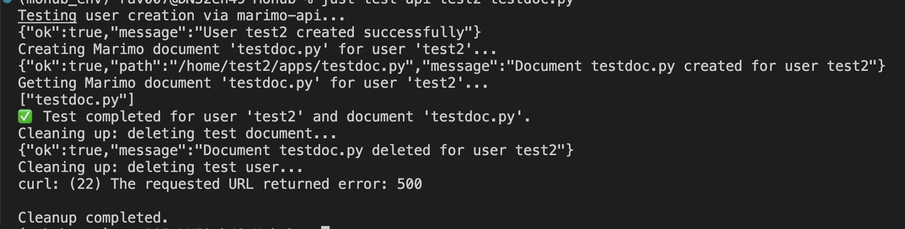

### Test result

To test your server run
```bach
    just test-api <username> <document name with .py>
```



### Architecture Diagram


### User Creation Flow


### Notebook Flow


# JupyterHub with Marimo Notebooks

This repository provides a complete configuration to deploy a JupyterHub server with Marimo notebook support.

## Prerequisites

### Package Installation

```bash
# JupyterHub and components
pip install jupyterhub notebook jupyterlab

# Just command runner  
pip install just

# Docker Compose
sudo apt-get update
sudo apt-get install docker-compose-plugin
```

## Buld Server

```bash
just config
```

### Clean up ports

```bash
just clean-ports
```
